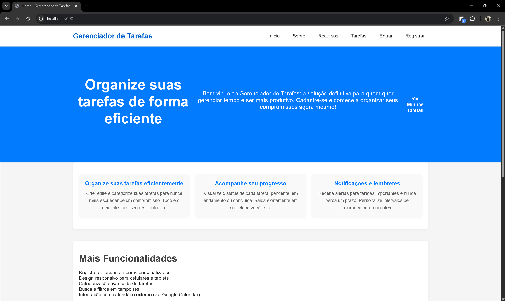
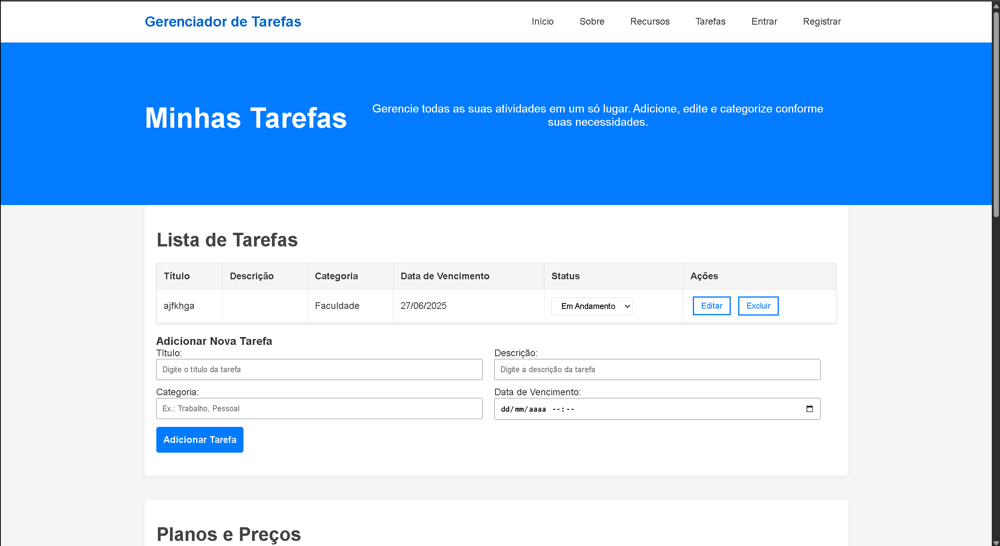

# Projeto Individual Módulo 2 - Gerenciador de Tarefas

## Descrição do Sistema

O "Gerenciador de Tarefas" é um sistema web completo que permite aos usuários organizar e gerenciar suas tarefas diárias, semanais ou mensais por meio de uma interface simples e intuitiva, com categorização e status de progresso.


## Funcionalidades Implementadas

- Visualização de tarefas em lista
- Adição de novas tarefas
- Categorização de tarefas
- Marcação de tarefas como concluídas
- Exclusão de tarefas
- Interface web responsiva

## Tecnologias Utilizadas

- **Frontend**: HTML, CSS, EJS (templates)
- **Backend**: Node.js, Express.js
- **Banco de Dados**: PostgreSQL
- **Arquitetura**: MVC (Model-View-Controller)

## Estrutura de Pastas e Arquivos

O sistema é construído utilizando o padrão de arquitetura MVC (Model-View-Controller):

### Arquitetura
- MVC (Model-View-Controller)
- RESTful API

## Como executar o projeto

1. Clone o repositório:
   ```bash
   git clone https://github.com/Zanette00/projeto_indiviual_modulo_2.git
   cd projeto_indiviual_modulo_2
   ```

2. Instale as dependências:
   ```bash
   npm install
   ```

3. Configure o banco de dados:
   - Crie um arquivo `.env` baseado no `.env.example`
   - Configure as variáveis de conexão com o PostgreSQL

4. Execute a migração para criar as tabelas:
   ```
   npm run migrate
   ```

5. Inicie o servidor:
   ```bash
   npm start
   ```

6. Acesse a aplicação em seu navegador:
   ```
   http://localhost:3000
   ```

## 📸 Screenshots

### Página Inicial


### Lista de Tarefas


### Edição de Tarefa


## 🎥 Vídeo de Demonstração

<video src="./docs/assets/video_entrega_final.mp4" width="100%" controls></video>

## 📚 Documentação Adicional

Para mais detalhes sobre a arquitetura e decisões técnicas, consulte o arquivo [WAD.md](docs/WAD.md).

## 👨‍💻 Autor

Gabriel Zanette - [GitHub](https://github.com/Zanette00)

## 📝 Licença

Este projeto está sob a licença MIT. Veja o arquivo [LICENSE](LICENSE) para mais detalhes.
